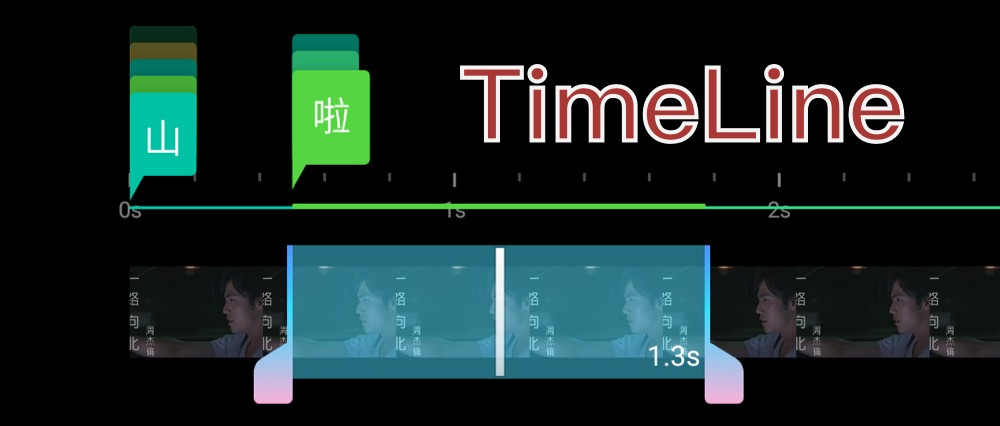

# VideoTimeLine 一组视频时间轴自定义控件

简介：
### 标签，可显示文字/图片
对应源码：TagLineView.kt

可以用来外挂一些视频素材，或者给视频打标签之类的作用。
起始时间接近的标签会被归为一组，点击可以进行切换，点击显示的弹窗的小角标会动态根据标签位置显示，时间轴滑动时会停留在屏幕的左边缘。

### 主轴，按时间轴缩放值抽取一定的帧显示
对应源码：VideoFrameRecyclerView.kt

支持双指缩放，双击放大、还原。
使用 glide 取帧方式加载帧，觉得速度太慢的可以使用 ffmpeg 框架取帧

### 时间选择控件
对应源码：SelectAreaView.kt ，可以选择标签/视频的时长

## Getting started
直接运行 app，参考 MainActivity 里面一些控件的调用方式

## License
VideoTimeLine 使用 Apache License 2.0 协议， 详情请参考 [LICENSE](./LICENSE)。

